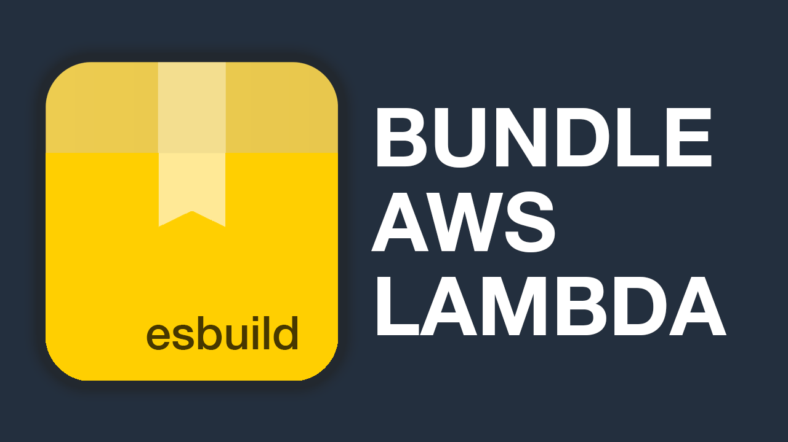

# lambda-build ⚡️


- Bundle, archive and upload your lambda functions using [esbuild](https://esbuild.github.io/)

## How it works

- 🎯 Point it to a js/ts file containing your lambda handler(s)
- 📦 Get a zip file containing tour bundle
- 🚀 Upload it to aws

## Install

```bash
npm i --save-dev lambda-build
```

- see options:

```bash
npx lambda-build --help
```

## CLI Usage

- if your handler is called `index.js|ts`, you can generate a local `archive.zip` by running:

```bash
npx lambda-build
```

- use [upload](https://github.com/AlexDisler/lambda-build#lambda-build-upload) to create a bundle and upload it to aws
- use [archive](https://github.com/AlexDisler/lambda-build#lambda-build-archive) to create a bundle and save it as a local `archive.zip` file

### `lambda-build archive`

`npx lambda-build archive` bundles your code and creates a local `archive.zip` file that you can then upload to aws yourself.

- using `-e`, set a custom entry file:
```bash
npx lambda-build archive -e src/index.ts
```

- using `-x`, exclude some libraries from bundling (for example, if you already load them in a layer):
```bash
npx lambda-build archive -e src/index.ts -x lodash dayjs
```

- using `-m`, generate a `meta.json` file which you can then use to [analyze your bundle](https://bundle-buddy.com/esbuild):
```bash
npx lambda-build archive -e src/index.ts -m
```

### `lambda-build upload`

`npx lambda-build upload` bundles your code and then uploads it directly to your AWS lambda functions (requires the [aws cli](https://docs.aws.amazon.com/cli/latest/userguide/cli-chap-configure.html) to be locally configured).

- specify the lambda functions that you would like to deploy to:
```bash
npx lambda-build upload my-lambda1 my-lambda2 -e src/index.ts
```

- you can specify the region using the `-r` flag (otherwise it defaults to `us-east-1`):
```bash
npx lambda-build upload my-lambda1 my-lambda2 -e src/index.ts -r us-east-2
```

## Library Usage

### `build()`

```ts
import { build } from 'lambda-build';

const res = await build({
  entry: 'src/index.js',
  external: ['lodash', 'dayjs'],
  metafile: true,
});
```
- returns a `res` object:
  - `res.archive` - *Buffer* - contents of the zip archive
  - `res.archiveSize` - *string* - the size of the archive
  - `res.meta` - *string* - contents of the meta file

### `buildAndUpload()`

```ts
import { buildAndUpload } from 'lambda-build';

const res = await buildAndUpload({
  entry: 'src/index.js',
  external: ['lodash', 'dayjs'],
  metafile: true,
  lambdas: ['my-lambda1', 'my-lambda2'],
  region: 'us-east-2',
});
```

- returns a `res` object:
  - `res.archive` - *Buffer* - contents of the zip archive
  - `res.archiveSize` - *string* - the size of the archive
  - `res.meta` - *string* - contents of the meta file
  - `updatedArns` - *string[]* - an array with the ARNs of the lambda functions that were successfully deployed

## Screencast

[](https://youtu.be/FmnFqjBk0to)

## More Lambda Screencasts

- [How to deploy a lambda function using versioning and aliases + API Gateway](https://youtu.be/OGMaE63YgEU)
- [How to install npm modules in AWS Lambda?](https://youtu.be/RnFowJ130pc)
- [How to deploy a lambda function using github actions?](https://youtu.be/UQiRhKgQ5X0)
- [How to use layers with Lambda functions?](https://youtu.be/i12H4cUFudU)
- [How to connect AWS Lambda to a MySQL database to update it? (using RDS proxy)](https://youtu.be/jOLgUjcTFEI)
- [How to use environment variables with a Lambda function? (and how to encrypt them with KMS)](https://youtu.be/J9QKS0NrH7I)
- [How to use ImageMagick with a Lambda function on AWS?](https://youtu.be/JdJo-_Y1ZIM)
- [How to pass a url query string or a route parameter to AWS Lambda from API Gateway?](https://youtu.be/V3i25clEvSE)
- [How to build a chat using Lambda + WebSocket + API Gateway? (nodejs)](https://youtu.be/BcWD-M2PJ-8)
- [What is an AWS lambda function?](https://youtu.be/okEvGTKpWl8)
- [How to restrict access to a static S3 site using HTTP Basic Auth?](https://youtu.be/gc3w_bMtcQE)
- [AWS Lambda intro - versions, aliases, concurrency, triggers, logs and monitoring](https://youtu.be/BFvF2oAnNpY)

## Follow me for updates

- [twitter](https://twitter.com/alexkrkn)
- [newsletter](https://www.getrevue.co/profile/alexkrkn)